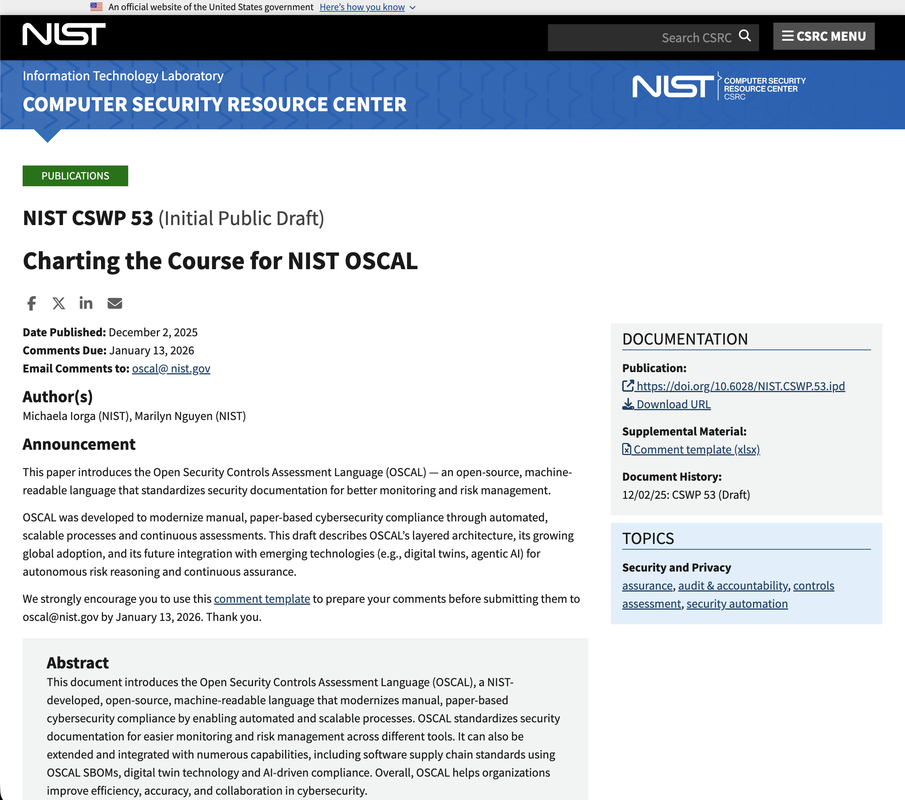
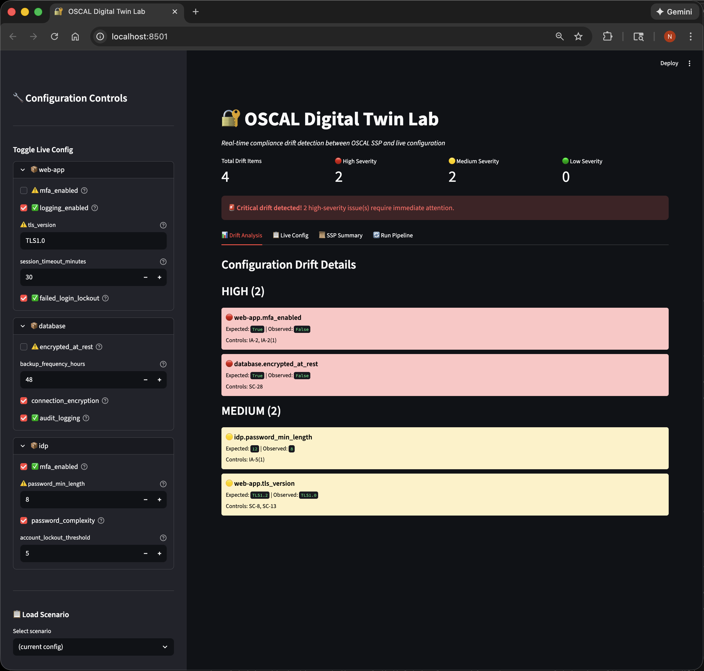

# oscal-digital-twin-lab
[](https://opensource.org/licenses/Apache-2.0)
[](https://www.python.org/downloads/)
[](https://langchain-ai.github.io/langgraph/)
[](https://pages.nist.gov/OSCAL/)
[](https://github.com/usnistgov/oscal-content)
[](https://langchain-ai.github.io/langgraph/)
[](https://pages.nist.gov/OSCAL-Reference/)

A tiny playground for **OSCAL-powered digital twins** with **LangGraph agents**.


> Inspired by NIST's <a href="https://csrc.nist.gov/pubs/cswp/53/charting-the-course-for-nist-oscal/ipd">CSWP 53 draft</a> (“Charting the Course for NIST OSCAL”)  and its vision of OSCAL-backed digital twins and agentic AI for continuous assurance, this repo simulates a mini environment:

- An OSCAL SSP = the **intended** system state (the twin's "DNA").
- A simple YAML **live-config** = the **actual** system state.
- A set of agents (LangGraph) that:
  - detect **drift** between the SSP and live config,
  - assess **risk**,
  - suggest **mitigation** actions, and
  - generate OSCAL-like **assessment / POA&M** fragments.

-----




## Architecture

```
┌─────────────────────────────────────────────────────────────────────┐
│                      OSCAL Digital Twin Lab                         │
├─────────────────────────────────────────────────────────────────────┤
│                                                                     │
│  ┌──────────────┐     ┌──────────────┐                              │
│  │  OSCAL SSP   │     │  Live Config │                              │
│  │  (Intended)  │     │  (Actual)    │                              │
│  └──────┬───────┘     └──────┬───────┘                              │
│         │                    │                                      │
│         └────────┬───────────┘                                      │
│                  ▼                                                  │
│  ┌───────────────────────────────────────────────────────────────┐  │
│  │                    LangGraph Pipeline                         │  │
│  │                                                               │  │
│  │  ┌──────────┐   ┌──────────┐   ┌────────────┐   ┌───────────┐ │  │
│  │  │TwinSync  │──▶│  Risk    │──▶│ Mitigation │──▶│Documentor │ │  │
│  │  │  Agent   │   │  Agent   │   │   Agent    │   │  Agent    │ │  │
│  │  └──────────┘   └──────────┘   └────────────┘   └───────────┘ │  │
│  │                                                               │  │
│  └───────────────────────────────────────────────────────────────┘  │
│                  │                                                  │
│                  ▼                                                  │
│  ┌─────────────────────────────────────────────────────────────┐    │
│  │  Outputs:                                                   │    │
│  │  • Drift Report (component/attribute mismatches)            │    │
│  │  • Risk Assessment (severity scores, rationale)             │    │
│  │  • Mitigation Plan (actionable remediation steps)           │    │
│  │  • OSCAL Fragments (assessment-results, POA&M)              │    │
│  └─────────────────────────────────────────────────────────────┘    │
│                                                                     │
└─────────────────────────────────────────────────────────────────────┘
```

## Stack

- OSCAL examples from [`usnistgov/oscal-content`](https://github.com/usnistgov/oscal-content)
- [LangGraph](https://github.com/langchain-ai/langgraph) for agent orchestration
- [LangChain](https://github.com/langchain-ai/langchain) for LLM plumbing
- [Streamlit](https://streamlit.io/) for interactive web UI
- [Pydantic](https://docs.pydantic.dev/) for data models
- Python 3.11+ (conda environment: `oscal-twin`)

## Quickstart

```bash
# Clone
git clone https://github.com/<you>/oscal-digital-twin-lab.git
cd oscal-digital-twin-lab

# Create conda environment
conda create -n oscal-twin python=3.11 -y
conda activate oscal-twin

# Install
pip install -e .

# Configure
cp .env.example .env
# Edit .env with your OpenAI API key

# Run CLI
python -m oscal_dtl.cli

# Run Streamlit UI
streamlit run src/oscal_dtl/app.py

# Run Scenario Runner
python -m oscal_dtl.scenario_runner data/scenarios/compliant.yaml
```

> **Note:** Drift detection works without an API key. LLM-powered agents (Risk, Mitigation, Documentor) require `OPENAI_API_KEY` in your `.env`.

## Example Output

```
=== Drift detected ===
- [high] web-app.mfa_enabled: expected=True observed=False controls=['IA-2', 'IA-2(1)']
- [medium] web-app.tls_version: expected=TLS1.2 observed=TLS1.0 controls=['SC-8', 'SC-13']
- [high] database.encrypted_at_rest: expected=True observed=False controls=['SC-28']

=== Risk Assessment ===
Score: 78.0
Summary: Critical security gaps identified in MFA and encryption controls...

=== Mitigation Plan ===
Immediate actions required to address high-severity configuration drift...
  web-app:
    - Enable MFA for all user accounts
    - Upgrade TLS to version 1.2 or higher
  database:
    - Enable encryption at rest using AES-256
```

## Project Structure

```
oscal-digital-twin-lab/
  README.md
  pyproject.toml
  .env.example
  data/
    oscal-content/        # git submodule: usnistgov/oscal-content
    ssp/
      demo-ssp.json       # small OSCAL SSP with oscal-dtl extensions
    live_state/
      live-config-1.yaml  # mock "actual system state"
  src/
    oscal_dtl/
      __init__.py
      config.py           # paths and settings
      models.py           # Pydantic models (LiveState, DriftItem, etc.)
      oscal_ssp_loader.py # load & parse SSP expectations
      twin_engine.py      # compare SSP vs live config
      agents/
        __init__.py
        twin_sync.py      # drift detection
        risk.py           # risk scoring (LLM)
        mitigation.py     # remediation suggestions (LLM)
        documentor.py     # OSCAL fragment generation (LLM)
      graph.py            # LangGraph wiring
      cli.py              # scenario runner
```

## How It Works

### 1. OSCAL SSP (Intended State)

The demo SSP uses custom `oscal-dtl:*` properties to map control implementations to specific configuration attributes:

```json
{
  "props": [
    { "name": "oscal-dtl:attribute", "value": "mfa_enabled" },
    { "name": "oscal-dtl:expected", "value": "true" }
  ]
}
```

### 2. Live Config (Actual State)

A simple YAML file representing current system configuration:

```yaml
system_id: demo-webapp
components:
  web-app:
    mfa_enabled: false      # ← drift!
    logging_enabled: true
    tls_version: "TLS1.0"   # ← drift!
```

### 3. Agent Pipeline

1. **TwinSyncAgent** - Compares SSP expectations vs live config → identifies drift items
2. **RiskAgent** - Uses LLM to rate severity (low/medium/high) and compute overall risk score
3. **MitigationAgent** - Proposes concrete remediation steps per component
4. **DocumentorAgent** - Generates OSCAL-like assessment-results and POA&M fragments

## Relationship to oscal-agent-lab

This project is a **sibling** to [oscal-agent-lab](https://github.com/ai-agents-cybersecurity/oscal-agent-lab):

| oscal-agent-lab | oscal-digital-twin-lab |
|-----------------|------------------------|
| RAG over 800-53 controls | Digital twin simulation |
| SSP diff comparison | SSP vs live config drift |
| Profile generation | Risk assessment |
| Schema validation | Mitigation planning |

Future integration: Share catalogs, RAG indices, and validation schemas between projects.

## Scenario Runner

Test "what-if" configuration scenarios without modifying the live config:

```bash
# Run a single scenario
python -m oscal_dtl.scenario_runner data/scenarios/compliant.yaml

# Compare multiple scenarios
python -m oscal_dtl.scenario_runner data/scenarios/*.yaml --compare

# Run with full LLM pipeline
python -m oscal_dtl.scenario_runner data/scenarios/mfa_disabled.yaml --full
```

Available scenarios:
- `compliant.yaml` - Fully compliant configuration (zero drift)
- `mfa_disabled.yaml` - MFA disabled across all components
- `encryption_disabled.yaml` - Encryption disabled
- `weak_passwords.yaml` - Reduced password requirements
- `logging_disabled.yaml` - Audit logging disabled

## Streamlit UI

Interactive web interface for drift visualization:

```bash
streamlit run src/oscal_dtl/app.py
```

Features:
- **Real-time drift detection** - Toggle config values and see drift update instantly
- **Scenario loader** - Apply predefined scenarios from the sidebar
- **SSP viewer** - Browse expectations defined in the OSCAL SSP
- **Full pipeline execution** - Run risk assessment, mitigation, and documentation generation

## Roadmap

- [x] ~~Add a "scenario runner" for what-if config testing~~
- [x] ~~Web UI to visualize drift over time (Streamlit)~~
- [ ] Map more complex attributes from real OSCAL SSP examples
- [ ] Integrate with `oscal-agent-lab` for shared catalogs/RAG
- [ ] Support for multiple SSP/config pairs
- [ ] Continuous monitoring mode

## References

- [NIST CSWP 53: Charting the Course for NIST OSCAL](https://csrc.nist.gov/pubs/cswp/53/charting-the-course-for-nist-oscal/ipd)
- [OSCAL Official Documentation](https://pages.nist.gov/OSCAL/)
- [usnistgov/oscal-content](https://github.com/usnistgov/oscal-content)
- [LangGraph Documentation](https://langchain-ai.github.io/langgraph/)

## License

Apache 2
